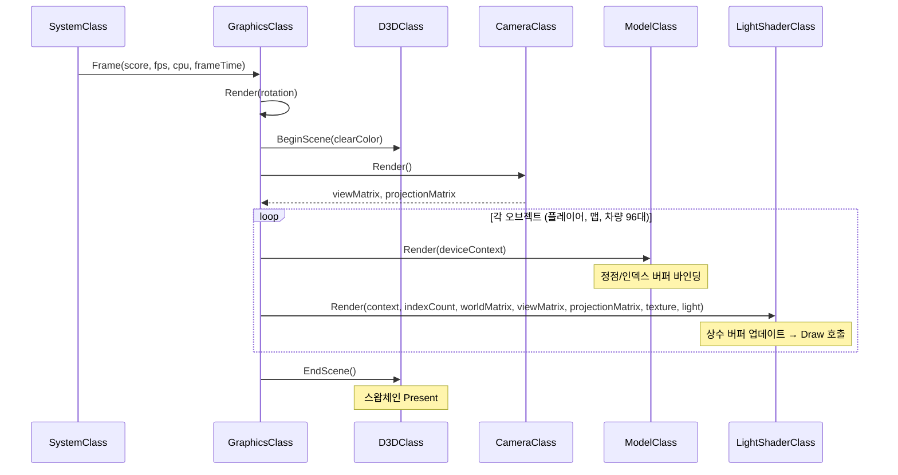

# CrossingHighway

## 개요

3D로 구현한 크로싱 하이웨이 스타일의 아케이드 게임입니다. 플레이어는 차량이 달리는 도로를 피해 앞으로 전진하며, 점수에 따라 차량 속도와 BGM이 변화하는 난이도 시스템을 포함합니다.

*   **장르**: 3D 아케이드
*   **플랫폼**: Windows Desktop
*   **개발 기간**: 2021.05.24 ~ 2021.06.11
*   **참여 인원**: 프로그래밍 2명
*   **역할**: 프로그래머

## 기술 스택

[](https://isocpp.org/) [](https://learn.microsoft.com/en-us/windows/win32/direct3d10/d3d10-graphics) [](https://learn.microsoft.com/en-us/windows/win32/direct3d11/atoc-dx-graphics-direct3d-11) [](https://learn.microsoft.com/en-us/windows/win32/direct3dhlsl/dx-graphics-hlsl)

[](https://visualstudio.microsoft.com/) [](https://developer.microsoft.com/en-us/windows/downloads/windows-sdk/)


## 기술 특징

* [1. 렌더링 파이프라인](#1-렌더링-파이프라인)
    * [1.1. Direct3D 초기화](#1-1-direct3d-초기화)
    * [1.2. 셰이더 시스템](#1-2-셰이더-시스템)
    * [1.3. 3D 모델 로딩](#1-3-3d-모델-로딩)
    * [1.4. 텍스처 로딩](#1-4-텍스처-로딩)
* [2. 게임 오브젝트 시스템](#2-게임-오브젝트-시스템)
    * [2.1. 차량 관리](#2-1-차량-관리)
    * [2.2. 무한 맵](#2-2-무한-맵)
    * [2.3. 파티클 이펙트](#2-3-파티클-이펙트)
* [3. 게임 로직](#3-게임-로직)
    * [3.1. 충돌 시스템](#3-1-충돌-시스템)
    * [3.2. 플레이어 이동](#3-2-플레이어-이동)
    * [3.3. 난이도 시스템](#3-3-난이도-시스템)
* [4. 입출력](#4-입출력)
    * [4.1. 입력 시스템](#4-1-입력-시스템)
    * [4.2. 사운드 시스템](#4-2-사운드-시스템)
    * [4.3. HUD](#4-3-hud)
* [5. 빌드 마이그레이션](#5-빌드-마이그레이션)
    * [5.1. 헤더 및 라이브러리 교체](#5-1-헤더-및-라이브러리-교체)
    * [5.2. 타입 및 함수 교체](#5-2-타입-및-함수-교체)
    * [5.3. 텍스처 로더 도입](#5-3-텍스처-로더-도입)
    * [5.4. const 정확성 수정](#5-4-const-정확성-수정)
    * [5.5. DDS 파일 포맷 수정](#5-5-dds-파일-포맷-수정)


## 1. 렌더링 파이프라인

Direct3D 11 기반의 실시간 3D 렌더링 파이프라인을 구축했습니다. 시스템은 네 가지 핵심 컴포넌트로 구성됩니다:
- **D3DClass**: 디바이스 초기화, 스왑체인 관리, 렌더 상태(Z버퍼, 알파 블렌딩) 전환
- **ShaderClass**: HLSL 셰이더 컴파일 및 상수 버퍼 바인딩을 담당하는 4종의 셰이더 클래스
- **ModelClass**: OBJ/MTL 포맷의 3D 모델을 파싱하여 정점/인덱스 버퍼로 변환
- **TextureClass**: WIC(PNG, JPG) 및 DDS 포맷 텍스처 로딩

> 원래 DirectX SDK (June 2010)에 의존하는 레거시 프로젝트였으나, Windows 10 SDK 기반으로 전면 마이그레이션하여 현대적 API로 전환했습니다. `D3DXMATRIX` → `XMMATRIX`, `D3DXMatrixPerspectiveFovLH()` → `XMMatrixPerspectiveFovLH()` 등 타입과 함수를 교체하고, `D3DX11CompileFromFile()` → `D3DCompileFromFile()` 셰이더 컴파일 API, `D3DX11CreateShaderResourceViewFromFile()` → `CreateWICTextureFromFile()` / `CreateDDSTextureFromFile()` 텍스처 로딩 API로 이전했습니다.

아래 다이어그램은 매 프레임 렌더링 시 각 컴포넌트 간의 호출 흐름을 나타냅니다.



### 1.1. Direct3D 초기화

`D3DClass`는 Direct3D 11 디바이스와 스왑체인을 초기화하고, 렌더 타겟 뷰, 깊이/스텐실 버퍼, 래스터라이저 상태, 뷰포트 등 그래픽스 파이프라인의 기반 리소스를 생성합니다. 투영 행렬(Perspective), 월드 행렬(Identity), 직교 행렬(Orthographic)을 사전 계산하여 저장하며, Z버퍼 및 알파 블렌딩 상태 전환 기능을 제공하여 3D 오브젝트 렌더링과 2D UI 렌더링을 전환할 수 있도록 합니다.

<details>
<summary>D3DClass 행렬 초기화</summary>

<br>

> 화면 비율에 맞는 투영 행렬, 기본 월드 행렬, 2D 렌더링용 직교 행렬을 `XMFLOAT4X4`에 저장합니다. `XMFLOAT4X4`는 멤버 변수 저장용이며, 연산 시 `XMLoadFloat4x4()`로 `XMMATRIX`로 변환하여 사용합니다.

<br>

```cpp
// d3dclass.cpp
// 투영 행렬 생성 - 원근 투영
fieldOfView = XM_PI / 4.0f;
screenAspect = (float)screenWidth / (float)screenHeight;
XMStoreFloat4x4(&m_projectionMatrix,
    XMMatrixPerspectiveFovLH(fieldOfView, screenAspect, screenNear, screenDepth));

// 월드 행렬 초기화 - 단위 행렬
XMStoreFloat4x4(&m_worldMatrix, XMMatrixIdentity());

// 직교 행렬 생성 - 2D UI 렌더링용
XMStoreFloat4x4(&m_orthoMatrix,
    XMMatrixOrthographicLH((float)screenWidth, (float)screenHeight, screenNear, screenDepth));
```

</details>

### 1.2. 셰이더 시스템

4종의 셰이더 클래스(`LightShader`, `TextureShader`, `FontShader`, `ParticleShader`)가 각각의 HLSL 셰이더 파일을 런타임에 컴파일하고, 상수 버퍼를 통해 변환 행렬과 라이팅 파라미터를 GPU에 전달합니다. `LightShader`는 Ambient + Diffuse + Specular 라이팅 모델을 구현하며, 카메라 위치 기반의 View Direction을 계산하여 Specular Highlight를 적용합니다.

<details>
<summary>Light Pixel Shader (HLSL)</summary>

<br>

> Ambient Light를 기본값으로 설정한 뒤, 법선 벡터와 광원 방향의 내적으로 Diffuse 강도를 계산합니다. 반사 벡터와 시선 방향의 내적에 Specular Power를 적용하여 하이라이트를 생성하고, 최종적으로 텍스처 색상과 합산합니다.

<br>

- light.ps

```hlsl
float4 LightPixelShader(PixelInputType input) : SV_TARGET
{
    float4 textureColor;
    float3 lightDir;
    float lightIntensity;
    float4 color;
    float3 reflection;
    float4 specular;

    // 텍스처 샘플링
    textureColor = shaderTexture.Sample(SampleType, input.tex);

    // Ambient Light 기본값 설정
    color = ambientColor;
    specular = float4(0.0f, 0.0f, 0.0f, 0.0f);

    // Diffuse 계산: 법선과 광원 방향의 내적
    lightDir = -lightDirection;
    lightIntensity = saturate(dot(input.normal, lightDir));

    if(lightIntensity > 0.0f)
    {
        color += (diffuseColor * lightIntensity);
        color = saturate(color);

        // Specular 계산: 반사 벡터와 시선 방향
        reflection = normalize(2 * lightIntensity * input.normal - lightDir);
        specular = pow(saturate(dot(reflection, input.viewDirection)), specularPower);
    }

    color = color * textureColor;
    color = saturate(color + specular);

    return color;
}
```

</details>

### 1.3. 3D 모델 로딩

`ModelClass`는 Wavefront OBJ 포맷을 파싱하여 Direct3D 11의 정점/인덱스 버퍼로 변환합니다. 먼저 `ReadFileCounts()`로 파일을 1차 순회하여 정점, 텍스처 좌표, 법선, 면의 개수를 집계한 뒤, `LoadDataStructures()`에서 2차 순회를 통해 면 인덱스 기반으로 정점 데이터를 조합하여 `ModelType` 배열을 생성합니다. 최종적으로 `InitializeBuffers()`에서 `VertexType`(position, texture, normal) 구조체 배열로 변환하여 GPU 버퍼를 생성합니다.

<details>
<summary>OBJ 모델 파싱 흐름</summary>

<br>

```cpp
// modelclass.cpp
bool ModelClass::Initialize(ID3D11Device* device, const char* modelFilename, const WCHAR* textureFilename)
{
    // 1단계: 파일 내 요소 개수 집계 (v, vt, vn, f)
    ReadFileCounts(modelFilename, vertexCount, textureCount, normalCount, faceCount);

    // 2단계: 면 데이터 기반으로 정점 배열 구성
    m_vertexCount = faceCount * 3;
    m_indexCount = m_vertexCount;
    LoadDataStructures(modelFilename, vertexCount, textureCount, normalCount, faceCount);

    // 3단계: 정점/인덱스 버퍼 생성 후 GPU 업로드
    InitializeBuffers(device);

    // 4단계: 텍스처 로딩
    LoadTexture(device, textureFilename);

    return true;
}
```

</details>

### 1.4. 텍스처 로딩

`TextureClass`는 파일 확장자에 따라 WIC(PNG, JPG, BMP)와 DDS 포맷을 분기하여 텍스처를 로딩합니다. DirectXTK의 `WICTextureLoader`와 DirectXTex의 `DDSTextureLoader`를 사용하여 `ID3D11ShaderResourceView`를 생성합니다.

<details>
<summary>DDS/WIC 분기 로딩</summary>

<br>

> 레거시 `D3DX11CreateShaderResourceViewFromFile()` 단일 함수를 대체하여, 파일 확장자 기반 분기 로직을 구현했습니다. DDS 파일은 GPU 네이티브 포맷으로 빠른 로딩이 가능하고, WIC 파일은 범용 이미지 포맷을 지원합니다.

<br>

- textureclass.cpp

```cpp
bool TextureClass::Initialize(ID3D11Device* device, const WCHAR* filename)
{
    HRESULT result;

    std::wstring fn(filename);
    if (fn.size() >= 4 && fn.substr(fn.size() - 4) == L".dds")
    {
        result = DirectX::CreateDDSTextureFromFile(device, filename, nullptr, &m_texture);
    }
    else
    {
        result = DirectX::CreateWICTextureFromFile(device, filename, nullptr, &m_texture);
    }

    if (FAILED(result)) return false;
    return true;
}
```

</details>


## 2. 게임 오브젝트 시스템

### 2.1. 차량 관리

4종의 차량(Car, SUV, Truck, Bus)을 각각 24대씩, 총 96대의 차량 오브젝트를 관리합니다. 각 차량 종류는 3가지 색상 변형을 가지며, `CarModelInfo` 구조체로 3D 모델, 월드 위치, 변환 행렬, AABB 바운딩 박스 크기를 캡슐화합니다. 차량은 레인별로 다른 속도로 이동하며, 화면 밖으로 나가면 반대편에서 재등장합니다.

<details>
<summary>차량 오브젝트 구조체와 이동 로직</summary>

<br>

- graphicsclass.h

```cpp
struct CarModelInfo
{
    ModelClass* m_carModel;      // 3D 모델
    XMFLOAT2 worldPosition;     // 월드 좌표 (x: 좌우, y: 전후)
    XMMATRIX worldMatrix;       // 변환 행렬
    XMFLOAT2 maxSize;           // AABB 로컬 최대값
    XMFLOAT2 minSize;           // AABB 로컬 최소값
    XMFLOAT2 maxPosSize;        // AABB 월드 최대값
    XMFLOAT2 minPosSize;        // AABB 월드 최소값
};
```

<br>

> 차량의 이동 속도는 레인(worldPosition.y 값)에 따라 3단계로 분류됩니다. 기본 속도에 현재 난이도의 가속값(`accel`)을 더하여 최종 속도를 결정합니다.

<br>

- graphicsclass.cpp

```cpp
void GraphicsClass::MoveCarForward(CarModelInfo &object) {
    if (object.worldPosition.x > 50) object.worldPosition.x = -50;  // 화면 밖 → 재등장

    if (object.worldPosition.y == 5 || object.worldPosition.y == 35 ||
        object.worldPosition.y == 60 || object.worldPosition.y == 80)
    {
        object.worldPosition.x += 0.08f + accel;   // 고속 레인
    }
    else if (object.worldPosition.y == 10 || object.worldPosition.y == 30 ||
             object.worldPosition.y == 40 || object.worldPosition.y == 55 ||
             object.worldPosition.y == 85)
    {
        object.worldPosition.x += 0.05f + accel;   // 중속 레인
    }
    else
    {
        object.worldPosition.x += 0.03f + accel;   // 저속 레인
    }
}
```

</details>

### 2.2. 무한 맵

2개의 맵 세그먼트(`infMap1Z`, `infMap2Z`)를 교대로 배치하여 무한 스크롤 맵을 구현합니다. 플레이어 위치를 기준으로 맵 세그먼트가 일정 거리 이상 뒤처지면 앞으로 이동시키고, 너무 앞서면 뒤로 이동시킵니다. 차량과 벽 오브젝트는 각 맵 세그먼트의 오프셋을 더하여 월드 좌표를 계산합니다.

<details>
<summary>무한 맵 세그먼트 교체 로직</summary>

<br>

```cpp
// graphicsclass.cpp - Render()
// 플레이어가 맵 세그먼트를 지나치면 200단위 앞으로 이동
if (m_SystemPlayerV.z - 150 > infMap1Z) {
    infMap1Z += 200;
}
if (m_SystemPlayerV.z - 150 > infMap2Z) {
    infMap2Z += 200;
}
// 플레이어가 뒤로 가면 맵 세그먼트도 뒤로 이동
if (m_SystemPlayerV.z + 80 < infMap1Z) {
    infMap1Z -= 200;
}
if (m_SystemPlayerV.z + 80 < infMap2Z) {
    infMap2Z -= 200;
}
```

</details>

### 2.3. 파티클 이펙트

`ParticleSystemClass`는 차량 후미에 배기 먼지 이펙트를 표현합니다. 파티클 생성(`EmitParticles`), 업데이트(`UpdateParticles`), 소멸(`KillParticles`)의 생명주기를 관리하며, 매 프레임 동적 정점 버퍼를 업데이트하여 알파 블렌딩으로 렌더링합니다. 각 파티클은 위치, 색상, 속도, 활성 상태를 가지며, 차량 96대 각각의 위치에 파티클 셰이더를 적용합니다.


## 3. 게임 로직

### 3.1. 충돌 시스템

AABB(Axis-Aligned Bounding Box) 기반의 2D 충돌 감지를 구현합니다. 플레이어와 96대의 차량, 그리고 2개 맵 세그먼트의 벽 오브젝트(세그먼트당 29개)에 대해 매 프레임 충돌 검사를 수행합니다. 차량과 충돌 시 게임오버로 전환하고, 벽과 충돌 시 이동을 차단하여 직전 위치로 되돌립니다.

<details>
<summary>AABB 충돌 감지</summary>

<br>

- graphicsclass.cpp

```cpp
bool GraphicsClass::CheckCubeIntersection(XMFLOAT2* vMin1, XMFLOAT2* vMax1,
                                          XMFLOAT2* vMin2, XMFLOAT2* vMax2)
{
    if (vMin1->x <= vMax2->x && vMax1->x >= vMin2->x &&
        vMin1->y <= vMax2->y && vMax1->y >= vMin2->y)
        return true;
    return false;
}

bool GraphicsClass::IsCollision() {
    XMFLOAT2 playerMin(m_PlayerV.x - 0.5f, m_PlayerV.z - 0.5f);
    XMFLOAT2 playerMax(m_PlayerV.x + 0.5f, m_PlayerV.z + 0.5f);

    // 차량 4종 × 24대 = 96회 검사
    for (auto object : carObject) {
        if (CheckCubeIntersection(&playerMin, &playerMax,
                                  &object.minPosSize, &object.maxPosSize)) {
            gameover = true;
            return true;
        }
    }
    // suvObject, truckObject, busObject 동일 검사 ...

    // 벽 충돌 검사 (맵 오프셋 적용)
    for (auto object : wallObject1) {
        XMFLOAT2 maxV = { object.maxPosSize.x, object.maxPosSize.y + infMap1Z };
        XMFLOAT2 minV = { object.minPosSize.x, object.minPosSize.y + infMap1Z };
        if (CheckCubeIntersection(&playerMin, &playerMax, &minV, &maxV))
            return true;
    }
    return false;
}
```

</details>

### 3.2. 플레이어 이동

방향키 입력을 받아 5단위씩 이동하며, 보간(Lerp)을 통해 부드러운 이동 애니메이션을 구현합니다. 목표 위치(`m_SystemPlayerV`)와 현재 위치(`m_PlayerV`) 사이를 매 프레임 10%씩 보간하여 자연스러운 점프 이동을 표현합니다. 이동 시 이전 위치를 `m_BackPlayerV`에 저장하여 벽 충돌 시 롤백에 사용합니다.

<details>
<summary>보간 기반 이동과 입력 처리</summary>

<br>

```cpp
// graphicsclass.cpp - Render()
// Lerp 보간으로 부드러운 이동
XMVECTOR vPlayer = XMLoadFloat3(&m_PlayerV);
XMVECTOR vSystem = XMLoadFloat3(&m_SystemPlayerV);
XMStoreFloat3(&m_PlayerV, XMVectorLerp(vPlayer, vSystem, 0.1f));
```

```cpp
// systemclass.cpp - Frame()
// 이동 입력 처리 - 보간이 완료된 후에만 다음 입력 허용
if (m_Input->IsUpPressed() &&
    ((float)m_Graphics->m_SystemPlayerV.z - m_Graphics->m_PlayerV.z) <= 0.2f) {
    m_Graphics->m_BackPlayerV = m_Graphics->m_SystemPlayerV;  // 롤백용 저장
    m_Graphics->m_SystemPlayerV.z += 5.0f;                    // 목표 위치 설정
    m_Graphics->m_PlayerRotation.y = 0.0f * XM_PI / 180;      // 회전 방향 설정
    score++;
    m_Sound->PlayJumpSound();
}
```

</details>

### 3.3. 난이도 시스템

점수 기반으로 차량 속도와 BGM이 단계적으로 변화합니다. 점수 임계값을 넘을 때마다 차량 이동 속도에 가산되는 `accel` 값이 증가하고, 동시에 BGM이 전환됩니다.

| 점수 구간 | 가속값 (accel) | BGM |
|-----------|---------------|-----|
| 0 ~ 15 | 0.0 | BGM 1 |
| 16 ~ 30 | 0.1 | BGM 2 |
| 31 ~ 45 | 0.2 | BGM 3 |
| 46 ~ | 0.3 | BGM 4 |

<details>
<summary>난이도 전환 로직</summary>

<br>

```cpp
// graphicsclass.cpp - 차량 가속
if (accel == 0 && m_score > 16)
    accel = 0.1f;
else if (accel == 0.1f && m_score > 31)
    accel = 0.2f;
else if (accel == 0.2f && m_score > 46)
    accel = 0.3f;
```

```cpp
// systemclass.cpp - BGM 전환
if (m_Graphics->m_score > 15 && isBgmPlayed1 == false) {
    m_Sound->StopBgm();
    m_Sound->PlayBgm2();
    isBgmPlayed1 = true;
}
if (m_Graphics->m_score > 30 && isBgmPlayed2 == false) {
    m_Sound->StopBgm();
    m_Sound->PlayBgm3();
    isBgmPlayed2 = true;
}
if (m_Graphics->m_score > 45 && isBgmPlayed3 == false) {
    m_Sound->StopBgm();
    m_Sound->PlayBgm4();
    isBgmPlayed3 = true;
}
```

</details>


## 4. 입출력

### 4.1. 입력 시스템

`InputClass`는 DirectInput 8을 사용하여 키보드와 마우스 입력을 처리합니다. 매 프레임 `ReadKeyboard()`와 `ReadMouse()`로 디바이스 상태를 읽어 `ProcessInput()`에서 가공하며, 방향키 4방향 이동과 ESC 종료를 지원합니다.

### 4.2. 사운드 시스템

`SoundClass`는 DirectSound를 사용하여 WAV 포맷의 오디오를 재생합니다. 6개의 세컨더리 버퍼를 관리하며 BGM 4트랙, 점프 효과음, 게임오버 효과음을 재생합니다. 난이도 전환 시 현재 BGM을 정지하고 다음 트랙으로 전환하는 `StopBgm()` → `PlayBgm()` 시퀀스로 BGM 체인지를 처리합니다.

### 4.3. HUD

`TextClass`와 `FontClass`를 사용하여 DDS 비트맵 폰트 기반의 텍스트 HUD를 렌더링합니다. Z버퍼를 비활성화하고 알파 블렌딩을 활성화한 2D 모드에서 현재 점수, FPS, CPU 사용률, 폴리곤 수, 오브젝트 수를 표시합니다. 게임오버 시 게임오버 이미지가 화면 상단에서 하강하는 애니메이션을 표시합니다.


## 5. 빌드 마이그레이션

원래 DirectX SDK (June 2010)에 의존하던 레거시 프로젝트를 Windows 10 SDK 기반의 현대적 API로 전면 마이그레이션했습니다. 레거시 SDK 없이 Visual Studio 2022 + Windows SDK만으로 빌드 가능하도록 전환했습니다.

### 5.1. 헤더 및 라이브러리 교체

레거시 DirectX SDK 전용 헤더를 Windows SDK에 포함된 현대적 헤더로 교체했습니다.

| 레거시 헤더 | 현대적 헤더 | 적용 대상 |
|------------|------------|----------|
| `d3dx10math.h` | `DirectXMath.h` | 수학 타입을 사용하는 헤더 8개 |
| `d3dx11tex.h` | `WICTextureLoader.h` + `DDSTextureLoader.h` | textureclass |
| `d3dx11async.h` | `d3dcompiler.h` | 셰이더 클래스 4개 |

링크 라이브러리도 `d3dx11.lib`, `d3dx10.lib`를 제거하고 `d3dcompiler.lib`로 교체했습니다.

### 5.2. 타입 및 함수 교체

D3DX 계열의 타입과 함수를 DirectXMath 및 D3DCompiler API로 전환했습니다.

<details>
<summary>타입 교체 상세</summary>

<br>

| 레거시 타입 | 현대적 타입 | 용도 |
|------------|------------|------|
| `D3DXMATRIX` (멤버변수) | `XMFLOAT4X4` | d3dclass, cameraclass, textclass |
| `D3DXMATRIX` (로컬/CB) | `XMMATRIX` | 셰이더 클래스 4개, graphicsclass |
| `D3DXVECTOR2` | `XMFLOAT2` | modelclass, bitmapclass, fontclass, particlesystemclass, textclass |
| `D3DXVECTOR3` | `XMFLOAT3` | 위와 동일 + cameraclass |
| `D3DXVECTOR4` | `XMFLOAT4` | lightclass, particlesystemclass, 셰이더 클래스 |
| `D3DX_PI` | `XM_PI` | systemclass |

</details>

<details>
<summary>함수 교체 상세</summary>

<br>

| 레거시 함수 | 현대적 함수 |
|------------|------------|
| `D3DXMatrixPerspectiveFovLH()` | `XMMatrixPerspectiveFovLH()` + `XMStoreFloat4x4()` |
| `D3DXMatrixIdentity()` | `XMMatrixIdentity()` + `XMStoreFloat4x4()` |
| `D3DXMatrixOrthoLH()` | `XMMatrixOrthographicLH()` + `XMStoreFloat4x4()` |
| `D3DXMatrixRotationYawPitchRoll()` | `XMMatrixRotationRollPitchYaw()` |
| `D3DXVec3TransformCoord()` | `XMVector3TransformCoord()` + `XMLoadFloat3` / `XMStoreFloat3` |
| `D3DXMatrixLookAtLH()` | `XMMatrixLookAtLH()` |
| `D3DX11CompileFromFile()` | `D3DCompileFromFile()` |
| `D3DXMatrixTranspose()` | `XMMatrixTranspose()` |

셰이더 컴파일 API는 매개변수 수가 12개에서 8개로 줄어들었으며, 플래그도 `D3D10_SHADER_ENABLE_STRICTNESS`에서 `D3DCOMPILE_ENABLE_STRICTNESS`로 변경되었습니다.

```cpp
// 레거시
D3DX11CompileFromFile(vsFilename, NULL, NULL, "FontVertexShader", "vs_5_0",
    D3D10_SHADER_ENABLE_STRICTNESS, 0, NULL, &vertexShaderBuffer, &errorMessage, NULL);

// 현대적
D3DCompileFromFile(vsFilename, NULL, NULL, "FontVertexShader", "vs_5_0",
    D3DCOMPILE_ENABLE_STRICTNESS, 0, &vertexShaderBuffer, &errorMessage);
```

</details>

### 5.3. 텍스처 로더 도입

레거시 `D3DX11CreateShaderResourceViewFromFile()` 단일 함수를 대체하기 위해 Microsoft의 오픈소스 텍스처 로더를 도입했습니다.

| 로더 | 출처 | 역할 |
|------|------|------|
| `WICTextureLoader` | DirectXTK (DirectX Tool Kit) | PNG, JPG, BMP 등 WIC 지원 이미지 로딩 |
| `DDSTextureLoader` | DirectXTex (standalone 버전) | DDS 포맷 텍스처 로딩 (`pch.h` 의존성 없음) |

### 5.4. const 정확성 수정

현대 C++ 컴파일러에서 문자열 리터럴을 비-const 포인터에 대입할 수 없기 때문에, 다수의 함수 시그니처에서 `char*` → `const char*`, `WCHAR*` → `const WCHAR*`로 변경했습니다.

<details>
<summary>변경된 함수 목록</summary>

<br>

| 파일 | 변경된 함수 |
|------|-----------|
| soundclass | `LoadWaveFile(char*, ...)` → `LoadWaveFile(const char*, ...)` |
| fontclass | `Initialize`, `BuildVertexArray`, `LoadFontData`, `LoadTexture` |
| textureclass | `Initialize(... WCHAR*)` → `Initialize(... const WCHAR*)` |
| bitmapclass | `Initialize`, `LoadTexture` |
| modelclass | `Initialize`, `LoadTexture`, `LoadDataStructures`, `ReadFileCounts`, `LoadModel` |
| textclass | `UpdateSentence(... char*, ...)` → `UpdateSentence(... const char*, ...)` |
| particlesystemclass | `Initialize`, `LoadTexture` |

</details>

### 5.5. DDS 파일 포맷 수정

`font.dds` 파일이 레거시 `D3DFMT_X8B8G8R8` 포맷을 사용하고 있어 DDSTextureLoader11에서 로딩할 수 없는 문제를 수정했습니다.

<details>
<summary>DDS 헤더 수정 상세</summary>

<br>

> 해당 포맷은 DXGI 매핑이 없어 `DXGI_FORMAT_UNKNOWN`을 반환하며 텍스처 로딩이 실패했습니다. DDS 헤더의 픽셀 포맷 플래그와 알파 마스크를 수정하고, 모든 픽셀의 알파 바이트를 불투명 값으로 설정하여 `DXGI_FORMAT_R8G8B8A8_UNORM`으로 정상 인식되도록 했습니다.

<br>

| 항목 | 수정 전 | 수정 후 |
|------|--------|--------|
| `PF_Flags` | `0x40` (DDPF_RGB) | `0x41` (DDPF_RGB \| DDPF_ALPHAPIXELS) |
| `ABitMask` | `0x00000000` | `0xFF000000` |
| 픽셀 알파 바이트 | `0x00` (투명) | `0xFF` (불투명) |
| 인식 포맷 | `DXGI_FORMAT_UNKNOWN` | `DXGI_FORMAT_R8G8B8A8_UNORM` |

</details>
